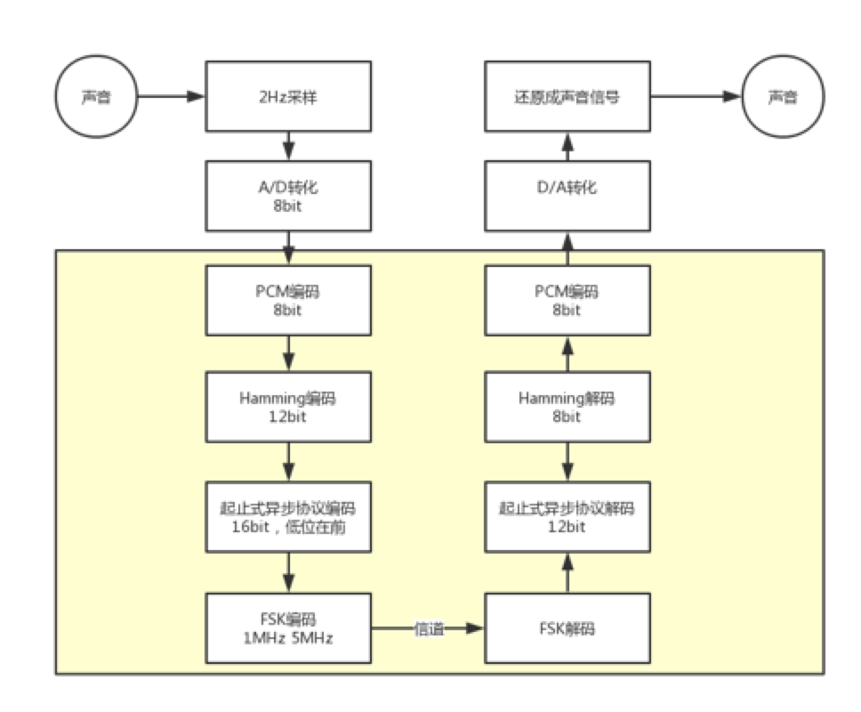
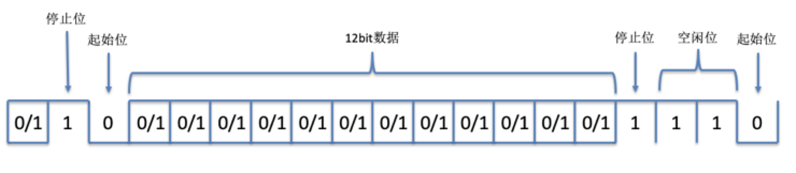

# FSKProject Design

通信原理实验课程作业

组员：王童、李百双、张栩铭

## 系统设计框图



## 时钟频率

```python
clk = 60000000 # 系统时钟
clk_sample = 0.5 # 采样率
clk_serial_bits = 7 # 串口通信频率
clk_f0 = clk_serial_bits * 50 = 350 # 0 fsk
clk_f1 = clk_serial_bits * 5 = 35 # 1 fsk

count_f0 = 400000 # 17 bits
# 以clk_f0为基准
count_f1 = 5 # 3 bits
count_serial_bits = 25 # 5 bits
count_sample = 350 # 9 bits
```

## 预设输入数据

走马灯

```verilog
8'b00000001
8'b00000010
8'b00000100
8'b00001000
8'b00010000
8'b00100000
8'b01000000
8'b10000000
```

## Hamming码

$$
k = 8\\
r = 4\\
n = 12
$$

$$
Q = 
\begin{bmatrix}
1 & 1 & 0 & 0 \\
1 & 0 & 1 & 0 \\
1 & 0 & 0 & 1 \\
0 & 1 & 1 & 0 \\
0 & 1 & 0 & 1 \\
0 & 0 & 1 & 1 \\
1 & 1 & 1 & 0 \\
0 & 1 & 1 & 1 \\
\end{bmatrix}
$$

### 监督矩阵

$$
H^T = \begin{bmatrix} Q \\ I \end{bmatrix} = 

\begin{bmatrix}
1 & 1 & 0 & 0 \\
1 & 0 & 1 & 0 \\
1 & 0 & 0 & 1 \\
0 & 1 & 1 & 0 \\
0 & 1 & 0 & 1 \\
0 & 0 & 1 & 1 \\
1 & 1 & 1 & 0 \\
0 & 1 & 1 & 1 \\
1 & 0 & 0 & 0 \\
0 & 1 & 0 & 0 \\
0 & 0 & 1 & 0 \\
0 & 0 & 0 & 1 \\
\end{bmatrix}
$$

### 生成矩阵

$$
X =
\begin{bmatrix}
I & Q
\end{bmatrix}
=
\begin{bmatrix}
1 & 0 & 0 & 0 & 0 & 0 & 0 & 0 & 1 & 1 & 0 & 0 \\
0 & 1 & 0 & 0 & 0 & 0 & 0 & 0 & 1 & 0 & 1 & 0 \\
0 & 0 & 1 & 0 & 0 & 0 & 0 & 0 & 1 & 0 & 0 & 1 \\
0 & 0 & 0 & 1 & 0 & 0 & 0 & 0 & 0 & 1 & 1 & 0 \\
0 & 0 & 0 & 0 & 1 & 0 & 0 & 0 & 0 & 1 & 0 & 1 \\
0 & 0 & 0 & 0 & 0 & 1 & 0 & 0 & 0 & 0 & 1 & 1 \\
0 & 0 & 0 & 0 & 0 & 0 & 1 & 0 & 1 & 1 & 1 & 0 \\
0 & 0 & 0 & 0 & 0 & 0 & 0 & 1 & 0 & 1 & 1 & 1 \\
\end{bmatrix}
$$


## 串口通信协议



传送时，数据的低位在前，高位在后

起止式异步协议的特点是一个字符一个字符传输，并且传送一个字符总是以起始位开始，以停止位结束，字符之间没有固定的时间间隔要求。其格式如上图所示。每一个字符的前面都有一位起始位（低电平，逻辑值0），字符本身由12位数据位组成，接着是1位停止位，停止位后面是不定长度的空闲位。停止位和空闲位都规定为高电平（逻辑值），这样就保证起始位开始处一定有一个下跳沿。

